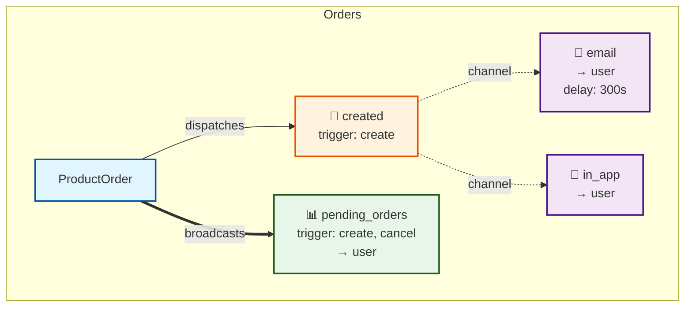

# AshDispatch Improvements Summary

## ✅ 1. Private Documentation Hosting

**Files Modified:**
- [.github/workflows/docs.yml](.github/workflows/docs.yml) - Updated for Cloudflare Pages
- [DOCS_DEPLOYMENT.md](DOCS_DEPLOYMENT.md) - Setup instructions

**What It Does:**
- Auto-builds ExDocs on every push to main
- Deploys to Cloudflare Pages (free tier)
- Supports private access control (restrict by email/domain/IP)

**Setup Required:**
1. Create free Cloudflare account
2. Get API token and Account ID
3. Add as GitHub secrets: `CLOUDFLARE_API_TOKEN`, `CLOUDFLARE_ACCOUNT_ID`
4. Configure access policies in Cloudflare dashboard
5. Docs will be available at: `https://ash-dispatch-docs.pages.dev`

See [DOCS_DEPLOYMENT.md](DOCS_DEPLOYMENT.md) for full instructions.

---

## ✅ 2. Mermaid Diagram Generation

**Files Created:**
- [lib/mix/tasks/ash_dispatch.gen.diagrams.ex](lib/mix/tasks/ash_dispatch.gen.diagrams.ex) - Mix task
- [lib/resource/info.ex](lib/resource/info.ex) - Added `counters/1` and `counter/2` functions

**What It Does:**
Generates beautiful Mermaid diagrams showing your entire dispatch flow:
- 📦 Resources with dispatch events
- 📧 Events with their trigger actions
- 🚀 Channels with transports and audiences
- 📊 Counter broadcasts
- 🎨 Color-coded by type

**Usage:**

```bash
# Generate diagrams for all domains
mix ash_dispatch.gen.diagrams

# Generate for specific domain
mix ash_dispatch.gen.diagrams --only MyApp.Accounts

# Generate as SVG (requires mermaid-cli)
mix ash_dispatch.gen.diagrams --format svg

# Generate as Markdown
mix ash_dispatch.gen.diagrams --format md
```

**Output:**
Creates `dispatch_diagrams/` directory with one diagram per domain:
- `my_app_accounts.mmd` - Mermaid source
- `my_app_accounts.svg` - (if --format svg)
- `my_app_accounts.md` - (if --format md)

**Example Output:**



---

## ✅ 3. Formatter Configuration

**Files Modified:**
- [.formatter.exs](.formatter.exs) - Added export configuration
- [FORMATTER_GUIDE.md](FORMATTER_GUIDE.md) - User guide

**What It Does:**
Makes your DSL code much cleaner by removing forced parentheses and cleaning up keyword lists.

**Before:**
```elixir
dispatch do
  event(:created, [
    trigger_on: :create,
    channels: [[transport: :email, audience: :user]]
  ])
end
```

**After:**
```elixir
dispatch do
  event :created,
    trigger_on: :create,
    channels: [
      [transport: :email, audience: :user]
    ]
end
```

**For Users of AshDispatch:**

Add to your project's `.formatter.exs`:
```elixir
[
  import_deps: [:ash, :ash_dispatch],
  inputs: ["*.{ex,exs}", "{config,lib,test}/**/*.{ex,exs}"]
]
```

Then run `mix format` - your DSL code will be automatically cleaned up!

See [FORMATTER_GUIDE.md](FORMATTER_GUIDE.md) for full details.

---

## Summary

All three improvements are production-ready:

1. **Private Docs** - Just needs Cloudflare setup, then auto-deploys
2. **Mermaid Diagrams** - Ready to use: `mix ash_dispatch.gen.diagrams`
3. **Formatter** - Already active in this project, users add `import_deps: [:ash_dispatch]`

These improvements make AshDispatch much more professional and easier to use! 🎉
