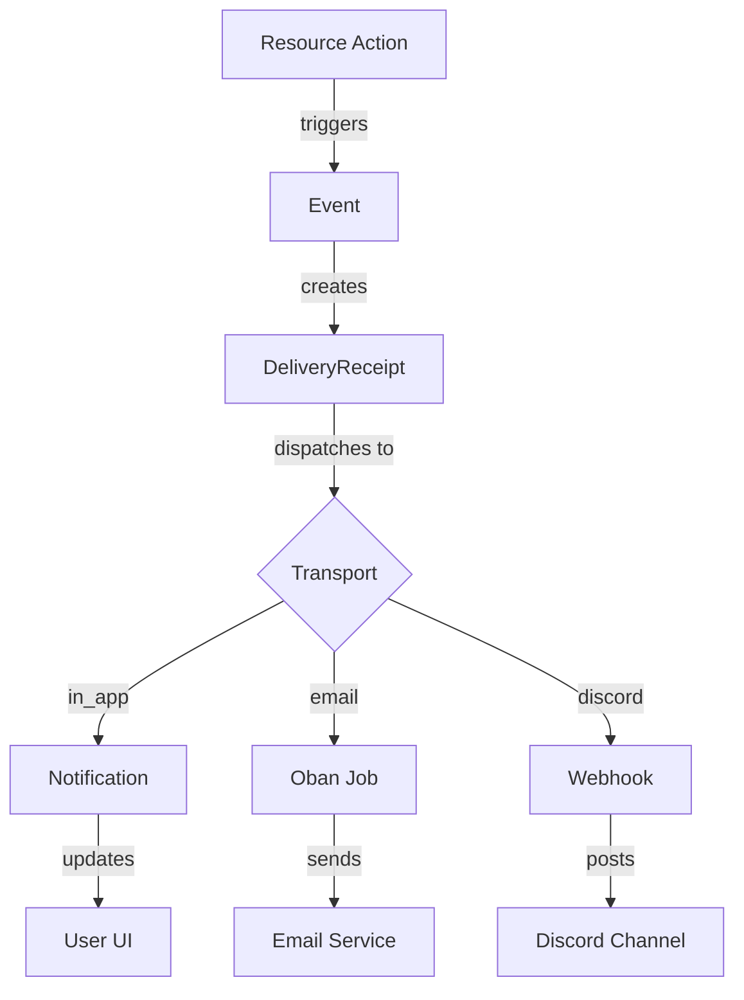

# AshDispatch

[](https://opensource.org/licenses/MIT)
[](https://ash-dispatch-docs.pages.dev)

**Status:** 🚧 **Active Development** - Extracting proven notification engine from Magasin into reusable Ash extension

---

**AshDispatch** is an event-driven notification and messaging system for [Ash Framework](https://ash-hq.org). It provides a declarative DSL for defining events in your resources and automatically dispatching them across multiple transports (email, in-app notifications, Discord, Slack, webhooks, etc.).

## Why AshDispatch?

### Declarative Event Definitions

Define events directly in your resources using familiar Ash DSL patterns:

```elixir
defmodule MyApp.Orders.ProductOrder do
  use Ash.Resource,
    extensions: [AshDispatch.Resource]

  actions do
    create :create_from_cart do
      accept [:user_id]
      # Your action logic...
    end
  end

  dispatch do
    event :created,
      trigger_on: :create_from_cart,
      channels: [
        [transport: :in_app, audience: :user],
        [transport: :email, audience: :user, delay: 300]
      ],
      content: [
        subject: "Order #{{order_number}} created",
        notification_title: "Your order was created",
        notification_message: "Order #{{order_number}} is being processed"
      ],
      metadata: [
        notification_type: :success
      ]
  end
end
```

### Key Features

- **🎯 Automatic Dispatch** - Events are automatically triggered by resource actions
- **📬 Multi-Transport** - Email, in-app, Discord, Slack, SMS, webhooks out of the box
- **⏰ Delayed Delivery** - Schedule notifications for later delivery
- **👤 User Preferences** - Respect user notification preferences automatically
- **📊 Delivery Tracking** - Full audit trail with delivery receipts
- **🔄 Automatic Retries** - Failed deliveries retry with exponential backoff
- **🎨 Template Interpolation** - `{{variable}}` syntax for dynamic content
- **📈 Real-Time Counters** - Declarative counter DSL with automatic Phoenix Channel broadcasting
- **⚡ Zero-Config Helpers** - `ChannelState`, `CounterLoader`, `NotificationLoader` for Phoenix integration
- **🔌 Extensible** - Add custom transports and event modules
- **🧪 Test-Friendly** - Factory integration for testing templates

## Tutorials

- [Getting Started with AshDispatch](lib/documentation/tutorials/getting-started.md) - Basic event setup with inline DSL
- [Manual Dispatch and Event Modules](lib/documentation/tutorials/manual-dispatch-and-events.md) - Standalone events, manual triggers, and the two-path pattern

## Topics

- [What is AshDispatch?](lib/documentation/topics/what-is-ash-dispatch.md)
- [Phoenix Channel Integration](lib/documentation/topics/phoenix-integration.md) - Zero-config helpers for real-time updates
- [Counter Broadcasting](lib/documentation/topics/counter-broadcasting.md) - Declarative counter DSL with auto-discovery
- [User Preferences](lib/documentation/topics/user-preferences.md)
- [Recipient Resolution](lib/documentation/topics/recipient-resolution.md)
- [Configuration](lib/documentation/topics/configuration.md)
- [App Integration](lib/documentation/topics/app-integration.md)
- [Code Generation](lib/documentation/topics/code-generation.md)
- [Oban Configuration](lib/documentation/topics/oban-configuration.md)

## Reference

- [AshDispatch.Resource DSL](lib/documentation/dsls/DSL-AshDispatch-Resource.md)

## Architecture Overview



## Installation

```elixir
def deps do
  [
    {:ash_dispatch, "~> 0.1.0"}
  ]
end
```

## Quick Example

```elixir
# 1. Add extension to resource
defmodule MyApp.Tickets.Ticket do
  use Ash.Resource,
    extensions: [AshDispatch.Resource]

  # 2. Define events
  dispatch do
    # Simple inline event
    event :created,
      trigger_on: :create,
      channels: [
        [transport: :in_app, audience: :user],
        [transport: :email, audience: :admin]
      ],
      content: [
        subject: "New ticket: {{title}}",
        notification_title: "Ticket Created",
        notification_message: "{{user_name}} created a new ticket"
      ]

    # Complex event with callback module
    event :status_changed,
      trigger_on: [:resolve, :close, :reopen],
      module: MyApp.Events.Tickets.StatusChanged
  end
end

# 3. That's it! Events dispatch automatically when actions run
Ticket
|> Ash.Changeset.for_create(:create, %{title: "Bug report"})
|> Ash.create!()
# -> Automatically dispatches :created event
# -> Creates in-app notification for user
# -> Sends email to admin
```

## Real-Time Counter Broadcasting

AshDispatch also provides **automatic real-time counter updates** with zero boilerplate:

```elixir
# 1. Define counters in your resource
defmodule MyApp.Orders.ProductOrder do
  use Ash.Resource,
    extensions: [AshDispatch.Resource]

  counters do
    # User sees their own pending orders
    counter :pending_orders,
      trigger_on: [:create, :complete, :cancel],
      counter_name: :pending_orders,
      query_filter: [status: :pending],
      audience: :user,
      invalidates: ["orders"]

    # Admins see ALL pending orders
    counter :admin_pending_orders,
      trigger_on: [:create, :complete, :cancel],
      counter_name: :admin_pending_orders,
      query_filter: [status: :pending],
      audience: :admin,
      invalidates: ["orders", "analytics"]
  end
end

# 2. Configure broadcasting (one line!)
# config/config.exs
config :ash_dispatch,
  counter_broadcast_fn: {MyAppWeb.UserChannel, :broadcast_counter}

# 3. Use helper in Phoenix Channel (one line!)
defmodule MyAppWeb.UserChannel do
  alias AshDispatch.Helpers.ChannelState

  def handle_info(:after_join, socket) do
    # Loads ALL counters automatically - no manual queries!
    initial_state = ChannelState.build(socket.assigns.user_id)
    # => %{"counters" => %{"pending_orders" => 5}, "notifications" => [...]}

    push(socket, "initial_state", initial_state)
    {:noreply, socket}
  end
end

# 4. That's it! Counters update in real-time automatically
Order.create!(%{status: :pending})
# -> Automatically broadcasts counter update to Phoenix Channel
# -> Frontend receives "counter_updated" event with new value
```

**Zero configuration, automatic discovery, real-time updates!**

See [Counter Broadcasting](lib/documentation/topics/counter-broadcasting.md) and [Phoenix Integration](lib/documentation/topics/phoenix-integration.md) for complete guides.

## Design Principles

### 1. Resource-Centric
Events are defined in resources, just like actions, attributes, and relationships.

### 2. Progressive Complexity
Start with simple inline events. Upgrade to callback modules when you need custom logic.

### 3. Receipt-First Pattern
All deliveries create a receipt record before dispatch, enabling full audit trails and reliable retries.

### 4. Fail-Safe Defaults
User preferences, rate limiting, and delivery policies protect users from notification fatigue.

### 5. Framework Integration
Deep integration with Ash actions, Oban jobs, and the Ash ecosystem.

## Development Status

**Current:** ✅ Resource extension complete and tested
**Next:** 🚧 Runtime dispatcher and Domain extension

## Contributing

This is currently being extracted from [Magasin](https://github.com/fyndgrossisten/magasin) where it has been running in production. Once stabilized, it will be published as a standalone package.

## License

MIT License - see LICENSE file for details.

## Acknowledgments

Built on the excellent [Ash Framework](https://ash-hq.org) by Zach Daniel and the Ash community.

Inspired by patterns from AshStateMachine, AshAuthentication, and years of building notification systems.
