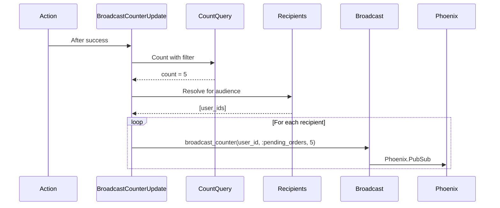

# Counter Broadcasting

AshDispatch provides **automatic real-time counter updates** through a declarative DSL. Define counters once in your resources, and AshDispatch automatically broadcasts updates to Phoenix Channels when actions complete.

## Why Counter Broadcasting?

Traditional approaches require manual counter management scattered across your codebase:

```elixir
# ❌ Manual approach - error-prone and scattered
def create_order(params) do
  {:ok, order} = Orders.create(params)

  # Manually update counter
  count = Orders.count_pending(order.user_id)
  Phoenix.PubSub.broadcast("user:#{order.user_id}", {:counter, :pending_orders, count})

  {:ok, order}
end
```

With AshDispatch, counters are **declarative and automatic**:

```elixir
# ✅ AshDispatch approach - declarative and automatic
counters do
  counter :pending_orders,
    trigger_on: [:create],
    counter_name: :pending_orders,
    query_filter: [status: :pending],
    audience: :user,
    invalidates: ["orders"]
end
```

**Benefits:**
- ✅ Define once, works everywhere
- ✅ Automatic broadcasting on action completion
- ✅ Type-safe with compile-time validation
- ✅ Query invalidation hints for frontend
- ✅ Multi-audience support (user, admin, system)
- ✅ Zero boilerplate in actions

---

## Quick Start

### 1. Define Counter in Resource

```elixir
defmodule MyApp.Orders.ProductOrder do
  use Ash.Resource,
    extensions: [AshDispatch.Resource]

  actions do
    create :create_from_cart
    update :complete
    update :cancel
  end

  # Define counters using DSL
  counters do
    counter :pending_orders,
      trigger_on: [:create, :complete, :cancel],
      counter_name: :pending_orders,
      query_filter: [status: :pending],
      audience: :user,
      invalidates: ["orders"]
  end
end
```

### 2. Configure Broadcasting

```elixir
# config/config.exs
config :ash_dispatch,
  counter_broadcast_fn: {MyAppWeb.UserChannel, :broadcast_counter}
```

### 3. Setup Phoenix Channel

```elixir
defmodule MyAppWeb.UserChannel do
  use MyAppWeb, :channel

  # Receive counter broadcasts from AshDispatch
  def broadcast_counter(user_id, counter_name, value, opts \\ []) do
    metadata = Keyword.get(opts, :metadata, %{})

    MyAppWeb.Endpoint.broadcast("user:#{user_id}", "counter_updated", %{
      counter: counter_name,
      value: value,
      metadata: metadata
    })
  end
end
```

### 4. Use on Frontend

```typescript
channel.on("counter_updated", (payload) => {
  // Update counter in UI
  setCounters(prev => ({
    ...prev,
    [payload.counter]: payload.value
  }));

  // Invalidate related queries
  payload.metadata.invalidate_queries?.forEach(queryKey => {
    queryClient.invalidateQueries([queryKey]);
  });
});
```

**That's it!** When orders are created, completed, or canceled, the `pending_orders` counter automatically updates in real-time.

---

## Counter DSL Reference

### counter/2

Defines a counter that automatically broadcasts when actions complete.

```elixir
counter :counter_identifier,
  trigger_on: [:action1, :action2],
  counter_name: :counter_name,
  query_filter: [filter_options],
  audience: :user | :admin | :partner | :system,
  invalidates: ["query_key1", "query_key2"],
  resource: MyApp.SomeResource  # Optional, defaults to current resource
```

#### Options

**`:trigger_on`** (required) - List of actions that trigger this counter update

```elixir
trigger_on: [:create]
trigger_on: [:create, :update, :destroy]
trigger_on: [:complete, :cancel]
```

**`:counter_name`** (required) - Name of the counter (atom)

```elixir
counter_name: :pending_orders
counter_name: :cart_items
counter_name: :admin_pending_reseller_requests
```

**`:query_filter`** (required) - Filter for counting records

```elixir
query_filter: [status: :pending]
query_filter: [active: true, archived: false]
query_filter: [user_id: {:context, :user_id}]
```

**`:audience`** (required) - Who receives this counter

```elixir
audience: :user     # Send to user who triggered the action
audience: :admin    # Send to all admins
audience: :partner  # Send to partner users
audience: :system   # Send to system recipients
```

**`:invalidates`** (optional) - Query keys to invalidate on frontend

```elixir
invalidates: ["orders"]
invalidates: ["orders", "analytics"]
```

**`:resource`** (optional) - Resource to query (defaults to current resource)

```elixir
resource: MyApp.Orders.ProductOrder  # Explicit resource
# Defaults to the resource where counter is defined
```

**`:group`** (optional) - Counter group for TypeScript organization

```elixir
group: :orders
group: :tickets
group: :cart
```

Groups are used by the TypeScript generator to create organized type definitions.

**`:global?`** (optional) - Bypass authorization for system-wide counters

```elixir
global?: true   # Bypasses policies, no user scoping
global?: false  # Default: uses authorization
```

Global counters are useful for admin dashboards that need system-wide totals regardless of policies.

**`:aggregate`** (optional) - Use Ash aggregate instead of query_filter

```elixir
aggregate: :pending_order_count
```

When specified, uses an Ash aggregate defined on the resource instead of running a separate count query.

**`:user_id_path`** (optional) - Path to resolve user_id through relationships

```elixir
user_id_path: [:cart, :user_id]  # For CartItem -> Cart -> User
```

---

## Audience Types

### :user - Scoped to Acting User

Broadcasts counter update only to the user who triggered the action.

```elixir
counter :pending_orders,
  trigger_on: [:create, :complete],
  counter_name: :pending_orders,
  query_filter: [status: :pending],
  audience: :user
```

**Behavior:**
- Counter query automatically scoped to `user_id` from context
- Only broadcasts to that specific user
- Perfect for user-specific counters (cart items, my orders, my tickets)

**Example:**
```elixir
# User creates an order
Order.create!(%{user_id: "user-123", ...})

# AshDispatch automatically:
# 1. Counts orders WHERE status = :pending AND user_id = "user-123"
# 2. Broadcasts ONLY to "user-123"
```

### :admin - All Admin Users

Broadcasts counter update to all users matching the admin filter.

```elixir
counter :admin_pending_reseller_requests,
  trigger_on: [:create, :accept, :decline],
  counter_name: :admin_pending_reseller_requests,
  query_filter: [status: :pending],
  audience: :admin
```

**Configuration:**
```elixir
config :ash_dispatch,
  user_module: MyApp.Accounts.User,
  recipient_filters: [
    audiences: [
      admin: [admin: true]
    ]
  ]
```

**Behavior:**
- Counter query NOT scoped to user (counts all records)
- Broadcasts to ALL users matching admin filter
- Perfect for admin dashboards

**Example:**
```elixir
# Anyone creates a reseller request
ResellerRequest.create!(...)

# AshDispatch automatically:
# 1. Counts requests WHERE status = :pending (ALL requests)
# 2. Finds all users WHERE admin = true
# 3. Broadcasts to each admin: "user:admin-1", "user:admin-2", etc.
```

### :partner, :system, Custom Audiences

Define custom audiences for specialized counter routing.

```elixir
counter :partner_pending_orders,
  trigger_on: [:create],
  counter_name: :partner_pending_orders,
  query_filter: [status: :pending],
  audience: :partner

counter :system_failed_jobs,
  trigger_on: [:fail],
  counter_name: :system_failed_jobs,
  query_filter: [status: :failed],
  audience: :system
```

**Configuration:**
```elixir
config :ash_dispatch,
  recipient_filters: [
    audiences: [
      partner: [role: :partner, active: true],
      system: []  # No filter, uses system_recipients
    ]
  ],
  system_recipients: [
    %{email: "ops@myapp.com", name: "Operations"}
  ]
```

---

## Real-World Examples

### E-Commerce Counters

```elixir
defmodule MyApp.Orders.ProductOrder do
  use Ash.Resource,
    extensions: [AshDispatch.Resource]

  counters do
    # User sees their own pending orders
    counter :user_pending_orders,
      trigger_on: [:create, :complete, :cancel],
      counter_name: :pending_orders,
      query_filter: [status: :pending],
      audience: :user,
      group: :orders,                    # TypeScript grouping
      invalidates: ["orders", "cart_items"]

    # User sees their own processing orders
    counter :user_processing_orders,
      trigger_on: [:create, :process, :complete],
      counter_name: :processing_orders,
      query_filter: [status: :processing],
      audience: :user,
      group: :orders,
      invalidates: ["orders"]

    # Admins see ALL pending orders (global bypasses policies)
    counter :admin_pending_orders,
      trigger_on: [:create, :complete, :cancel],
      counter_name: :admin_pending_orders,
      query_filter: [status: :pending],
      audience: :admin,
      group: :orders,
      global?: true,                     # No user scoping, bypass auth
      invalidates: ["orders", "analytics"]

    # Admins see ALL processing orders
    counter :admin_processing_orders,
      trigger_on: [:create, :process, :complete],
      counter_name: :admin_processing_orders,
      query_filter: [status: :processing],
      audience: :admin,
      group: :orders,
      global?: true,
      invalidates: ["orders", "analytics"]
  end
end
```

### Using Ash Aggregates

For complex counting logic, use Ash aggregates:

```elixir
defmodule MyApp.Accounts.User do
  use Ash.Resource,
    extensions: [AshDispatch.Resource]

  aggregates do
    # Define aggregate on resource
    count :unread_notification_count, :notifications do
      filter expr(read_at == nil)
    end
  end

  counters do
    # Use aggregate instead of query_filter
    counter :unread_notifications,
      trigger_on: [:mark_read, :mark_unread],
      aggregate: :unread_notification_count,  # References aggregate above
      audience: :user,
      group: :notifications,
      invalidates: ["notifications"]
  end
end
```

### Support Ticket Counters

```elixir
defmodule MyApp.Tickets.Ticket do
  use Ash.Resource,
    extensions: [AshDispatch.Resource]

  counters do
    # User sees their open tickets
    counter :user_open_tickets,
      trigger_on: [:create, :resolve, :close],
      counter_name: :open_tickets,
      query_filter: [status: :open],
      audience: :user,
      invalidates: ["tickets"]

    # User sees their in-progress tickets
    counter :user_in_progress_tickets,
      trigger_on: [:start, :resolve, :close],
      counter_name: :in_progress_tickets,
      query_filter: [status: :in_progress],
      audience: :user,
      invalidates: ["tickets"]

    # Support team sees ALL open tickets
    counter :admin_open_tickets,
      trigger_on: [:create, :resolve, :close],
      counter_name: :admin_open_tickets,
      query_filter: [status: :open],
      audience: :admin,
      invalidates: ["tickets", "support_dashboard"]

    # Support team sees ALL in-progress tickets
    counter :admin_in_progress_tickets,
      trigger_on: [:start, :resolve, :close],
      counter_name: :admin_in_progress_tickets,
      query_filter: [status: :in_progress],
      audience: :admin,
      invalidates: ["tickets", "support_dashboard"]
  end
end
```

### Shopping Cart Counter

```elixir
defmodule MyApp.Catalog.Cart do
  use Ash.Resource,
    extensions: [AshDispatch.Resource]

  counters do
    # Real-time cart item count
    counter :cart_items,
      trigger_on: [:add_item, :remove_item, :clear],
      counter_name: :cart_items,
      query_filter: [],  # Count all items in user's cart
      audience: :user,
      invalidates: ["cart", "checkout"]
  end
end
```

---

## Query Invalidation

Counters can specify which frontend queries should be invalidated when they update.

### Why Query Invalidation?

When a counter changes, related data on the frontend may be stale:

```typescript
// Counter says 5 pending orders
const { counters } = useUserChannel();
// => { pending_orders: 5 }

// But the order list query might have old data!
const { data: orders } = useQuery(['orders', 'pending']);
// => Still showing 4 orders (stale!)
```

**Solution:** Counter broadcasts include invalidation hints:

```elixir
counter :pending_orders,
  # ...
  invalidates: ["orders"]  # ← Tell frontend to refetch order queries
```

### Frontend Integration

```typescript
channel.on("counter_updated", (payload) => {
  // Update counter
  setCounters(prev => ({
    ...prev,
    [payload.counter]: payload.value
  }));

  // Invalidate related queries
  payload.metadata.invalidate_queries?.forEach(queryKey => {
    queryClient.invalidateQueries([queryKey]);
  });
});
```

**Result:** Counter updates automatically trigger data refetches!

### Multiple Invalidations

```elixir
counter :pending_orders,
  trigger_on: [:create],
  counter_name: :pending_orders,
  query_filter: [status: :pending],
  audience: :user,
  invalidates: [
    "orders",      # Refetch order lists
    "analytics",   # Refetch analytics dashboard
    "reports"      # Refetch report data
  ]
```

---

## How It Works

### Compile-Time Transformation

The counter DSL is transformed at compile-time into Ash changes:

```elixir
# You write:
counters do
  counter :pending_orders,
    trigger_on: [:create],
    counter_name: :pending_orders,
    query_filter: [status: :pending],
    audience: :user
end

# AshDispatch injects:
create :create do
  # ... your existing logic
  change AshDispatch.Changes.BroadcastCounterUpdate,
    counter_name: :pending_orders,
    query_filter: [status: :pending],
    audience: :user,
    invalidates: []
end
```

### Runtime Flow

1. **Action Executes**: User creates an order
2. **Counter Change Runs**: After action success, `BroadcastCounterUpdate` runs
3. **Count Query**: Executes count query with filter
4. **Resolve Recipients**: Determines who receives the update based on audience
5. **Broadcast**: Calls configured `counter_broadcast_fn` for each recipient



---

## Auto-Discovery with CounterLoader

Counters defined in the DSL are automatically discovered by `AshDispatch.Helpers.CounterLoader` when users connect to Phoenix Channels.

### How It Works

```elixir
# In your UserChannel
alias AshDispatch.Helpers.CounterLoader

def handle_info(:after_join, socket) do
  # Automatically discovers and loads ALL counters
  counters = CounterLoader.load_counters_for_user(socket.assigns.user_id)
  # => %{pending_orders: 5, cart_items: 3, open_tickets: 2}

  push(socket, "initial_state", %{counters: counters})
  {:noreply, socket}
end
```

**What happens:**
1. Scans all configured Ash domains
2. Finds all resources with `counters do` blocks
3. Reads counter definitions from DSL
4. Filters counters by user's audiences
5. Executes each counter's query
6. Returns map of counter names to values

**Zero configuration needed!** Just define counters in resources, they're automatically available.

---

## Configuration

### Required Configuration

```elixir
# config/config.exs
config :ash_dispatch,
  # Domains to scan for counter definitions
  domains: [MyApp.Orders, MyApp.Tickets, MyApp.Catalog],

  # User module for audience checking
  user_module: MyApp.Accounts.User,

  # Function to call when broadcasting counters
  counter_broadcast_fn: {MyAppWeb.UserChannel, :broadcast_counter}
```

### Audience Filters

Define how to identify users for each audience:

```elixir
config :ash_dispatch,
  recipient_filters: [
    audiences: [
      admin: [admin: true],
      partner: [role: :partner, active: true],
      support: [role: :support],
      user: []  # All authenticated users
    ]
  ]
```

### Complete Example

```elixir
# config/config.exs
config :ash_dispatch,
  # Resource discovery
  domains: [
    MyApp.Orders,
    MyApp.Tickets,
    MyApp.Catalog,
    MyApp.Accounts,
    MyApp.Requests
  ],

  # User resolution
  user_module: MyApp.Accounts.User,

  # Audience filters
  recipient_filters: [
    audiences: [
      admin: [admin: true],
      partner: [role: :partner],
      user: []
    ]
  ],

  # Broadcasting
  counter_broadcast_fn: {MyAppWeb.UserChannel, :broadcast_counter}
```

---

## Testing

### Test Counter Broadcasts

```elixir
defmodule MyApp.OrdersTest do
  use MyApp.DataCase

  test "broadcasts pending_orders counter on create" do
    user = build(:user) |> create!()

    # Create order
    order = build(:product_order, %{user_id: user.id, status: :pending})
      |> create!()

    # Assert counter broadcast
    assert_received {:counter_broadcast, ^user.id, :pending_orders, 1, _opts}
  end
end
```

### Mock Counter Broadcasting

```elixir
# config/test.exs
config :ash_dispatch,
  counter_broadcast_fn: {MyAppTest.MockCounterBroadcaster, :broadcast}

# test/support/mock_counter_broadcaster.ex
defmodule MyAppTest.MockCounterBroadcaster do
  def broadcast(user_id, counter_name, value, opts) do
    send(self(), {:counter_broadcast, user_id, counter_name, value, opts})
    :ok
  end
end
```

### Test Counter Queries

```elixir
test "counter query returns correct count" do
  user = build(:user) |> create!()

  # Create 3 pending orders
  build_list(3, :product_order, %{user_id: user.id, status: :pending})
  |> Enum.each(&create!/1)

  # Load counter
  counters = CounterLoader.load_counters_for_user(user.id)

  assert counters[:pending_orders] == 3
end
```

---

## Performance Optimization

### Database Indexes

Add indexes for fast counter queries:

```elixir
# In migration
create index(:orders, [:user_id, :status])
create index(:tickets, [:user_id, :status])
create index(:carts, [:user_id])
```

### Counter Query Optimization

Use efficient filters:

```elixir
# ✅ Good - indexed fields
query_filter: [status: :pending]
query_filter: [user_id: {:context, :user_id}, active: true]

# ❌ Avoid - unindexed or complex queries
query_filter: [fragment("expensive_calculation(?) > 10", field(:amount))]
```

### Batch Counter Updates

If multiple actions update the same counter, consider batching:

```elixir
# Instead of broadcasting on every item add/remove
# Broadcast once after bulk operation completes
```

---

## Troubleshooting

### Counter Not Broadcasting

**Check:**
1. `trigger_on` matches action name exactly
2. `counter_broadcast_fn` configured
3. Action completes successfully
4. No errors in logs

**Debug:**
```elixir
# Check counter definitions
AshDispatch.Dsl.Info.counters(MyApp.Orders.ProductOrder)

# Verify broadcast function
Application.get_env(:ash_dispatch, :counter_broadcast_fn)

# Test manually
AshDispatch.Changes.BroadcastCounterUpdate.broadcast_counter_update(
  %{user_id: "test"},
  :pending_orders,
  [status: :pending],
  :user,
  []
)
```

### Wrong Counter Value

**Check:**
1. `query_filter` matches intended records
2. Counter scoping (`:user` audience adds user_id filter automatically)
3. Database state

**Debug:**
```elixir
# Test query manually
MyApp.Orders.ProductOrder
|> Ash.Query.filter(status: :pending)
|> Ash.Query.filter(user_id == ^user_id)  # For :user audience
|> Ash.count!()
```

### Counter Not Loading on Join

**Check:**
1. Counter audience matches user
2. `:domains` configuration includes resource's domain
3. `:user_module` configured
4. User has correct attributes for audience filter

**Debug:**
```elixir
# Check domains
Application.get_env(:ash_dispatch, :domains)

# Test counter loading manually
CounterLoader.load_counters_for_user(user.id)
```

---

## TypeScript Generation

AshDispatch includes a Mix task to generate TypeScript types and constants for your counters.

### Generate Counter Types

```bash
# Generate to default location
mix ash_dispatch.gen.counter_types

# Specify output path
mix ash_dispatch.gen.counter_types --output lib/my_app_web/static/js/counters.ts

# Generate for specific domain only
mix ash_dispatch.gen.counter_types --only MyApp.Orders
```

### Generated Output

The generator creates a TypeScript file with:

```typescript
// Auto-generated by mix ash_dispatch.gen.counter_types
// Do not edit manually

// Types grouped by counter group
export type OrdersCounters = {
  pending_orders: number;
  processing_orders: number;
  admin_pending_orders: number;
};

export type CartCounters = {
  cart_items: number;
};

export type AllCounters = CartCounters & OrdersCounters;

// Counter names organized by source resource
export const COUNTERS = {
  cart: {
    cart_items: "cart_items",
  },
  cart_item: {
    cart_items: "cart_items",  // Same counter, different triggers
  },
  product_order: {
    pending_orders: "pending_orders",
    processing_orders: "processing_orders",
    admin_pending_orders: "admin_pending_orders",
  },
} as const;

// Merged metadata from all sources
export const COUNTER_METADATA = {
  cart_items: {
    audience: "user",
    invalidates: ["cart"],
    sources: ["cart", "cart_item"],  // Defined in multiple resources
  },
  pending_orders: {
    audience: "user",
    invalidates: ["cart_items", "orders"],
    sources: ["product_order"],
  },
  admin_pending_orders: {
    audience: "admin",
    invalidates: ["orders"],
    sources: ["product_order"],
  },
} as const;

export type CounterName = "cart_items" | "pending_orders" | "admin_pending_orders";

export function isValidCounter(name: string): name is CounterName {
  return name in COUNTER_METADATA;
}
```

### Using Generated Types

```typescript
import {
  COUNTERS,
  COUNTER_METADATA,
  getCounterAccessors,
  type AllCounters,
  type CounterName
} from "./counters";

// Type-safe counter access with snake_case
const pendingCount = counters[COUNTERS.product_order.pending_orders];

// Auto-generated camelCase accessors (no manual maintenance!)
const accessors = getCounterAccessors(counters);
console.log(accessors.pendingOrders);
console.log(accessors.adminOpenTickets);

// Check if counter should be shown to user
function shouldShowCounter(name: CounterName, isAdmin: boolean) {
  const meta = COUNTER_METADATA[name];
  return meta.audience === "user" || (meta.audience === "admin" && isAdmin);
}

// Get invalidation queries for a counter
function getInvalidations(name: CounterName): string[] {
  return COUNTER_METADATA[name].invalidates;
}
```

### React Hook Integration

The generated types and helpers eliminate almost all manual frontend work.

**Store (one-time setup, never changes):**

```typescript
// lib/stores/use-counter-store.ts
import { create } from 'zustand'
import { DEFAULT_COUNTERS, type AllCounters, type CounterName } from '@/lib/counters'

export type Counters = AllCounters

interface CounterState {
  counters: Counters
  setCounters: (counters: Partial<Counters>) => void
  setCounter: (key: CounterName, value: number) => void
  resetCounters: () => void
}

export const useCounterStore = create<CounterState>()((set) => ({
  counters: DEFAULT_COUNTERS,
  setCounters: (newCounters) => set((state) => ({ counters: { ...state.counters, ...newCounters } })),
  setCounter: (key, value) => set((state) => ({ counters: { ...state.counters, [key]: value } })),
  resetCounters: () => set({ counters: DEFAULT_COUNTERS }),
}))
```

**Hook (one-time setup, never changes):**

```typescript
// hooks/use-counters.ts
import { useCounterStore } from '@/lib/stores/use-counter-store'
import { getCounterAccessors } from '@/lib/counters'

export function useCounters() {
  const counters = useCounterStore((state) => state.counters)
  return {
    ...getCounterAccessors(counters),
    counters,
  }
}
```

**Usage in components:**

```typescript
function MyComponent() {
  const { cartItems, pendingOrders, adminOpenTickets } = useCounters()
  // Full TypeScript autocomplete!
}
```

### Zero-Maintenance Workflow

When you add new counters in Elixir:

1. Add counter to resource DSL
2. Run `mix ash_dispatch.gen.counter_types --output path/to/counters.ts`
3. **Done!** No frontend changes needed

The generated file includes:
- `DEFAULT_COUNTERS` - Store initialization
- `AllCounters` type - Full type definition
- `CounterAccessors` type - camelCase return type
- `getCounterAccessors()` - Converts snake_case to camelCase
- `COUNTER_METADATA` - Invalidates, audience, sources

### Multi-Resource Counters

When the same counter is defined in multiple resources (e.g., `cart_items` in both Cart and CartItem), the generator:

1. **Merges invalidates** - Union of all invalidates from all sources
2. **Tracks sources** - Shows which resources define the counter
3. **Validates consistency** - Warns if audience differs between resources

This allows different actions to trigger the same counter update:

```elixir
# In Cart resource
counter :cart_items,
  trigger_on: [:add_item, :clear],  # Triggered by cart actions
  audience: :user,
  group: :cart

# In CartItem resource
counter :cart_items,
  trigger_on: [:create, :destroy],  # Triggered by item actions
  audience: :user,
  group: :cart
```

Both will broadcast the same `cart_items` counter but from different action triggers.

---

## Counter Store as Single Source of Truth

When building features that need real-time counts, **always read from the counter store** rather than maintaining separate state.

### Example: Notification Badge

```typescript
// ❌ Wrong - separate state that won't sync
export function useNotifications() {
  const [unreadCount, setUnreadCount] = useState(0) // Gets out of sync!
  // ...
}

// ✅ Correct - read from counter store
export function useNotifications() {
  const unreadCount = useCounterStore(
    (state) => state.counters.unread_notifications
  )
  // unreadCount automatically updates via WebSocket
}
```

### Why This Matters

1. **Real-time sync** - Counter store receives broadcasts from all tabs/sessions
2. **No duplication** - Single source means no sync bugs
3. **Type-safe** - Counter names validated by generated types

### Pattern for Feature Hooks

```typescript
// Any feature that needs a real-time count
export function useFeatureWithCount() {
  const featureStore = useFeatureStore()
  const count = useCounterStore((state) => state.counters.my_counter)

  return {
    items: featureStore.items,
    count, // From counter store, not feature store
    // ...actions
  }
}
```

---

## LiveView vs AshTypescript/SPA

This TypeScript counter system is designed for **Single Page Applications** (React, Vue, etc.) using AshTypescript.

### For SPA/AshTypescript Apps

Use the full TypeScript integration:
- Generated types and store
- Phoenix channels for real-time updates
- Zustand/Redux for state management

### For LiveView Apps

LiveView already has real-time updates via its socket connection. The counter DSL and broadcasting still work, but frontend consumption differs:

```elixir
# LiveView can use PubSub directly
def handle_info({:counter_updated, counter, value}, socket) do
  {:noreply, assign(socket, counter, value)}
end
```

The Elixir-side counter DSL, broadcasting, and Phoenix channel helpers work identically - only the frontend consumption layer differs.

---

## Next Steps

- [Phoenix Channel Integration](phoenix-integration.md) - Setup channels with helpers
- [Configuration](configuration.md) - Complete configuration reference
- [Testing](testing-events.md) - Test your counters
