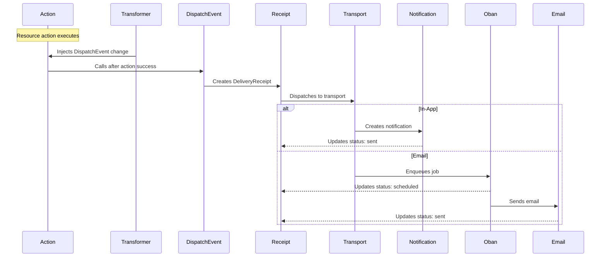

# What is AshDispatch?

## The Problem: Notification Sprawl

In most applications, notifications start simple but quickly become complex:

```elixir
# Started simple...
def create_order(params) do
  with {:ok, order} <- Orders.create(params) do
    Email.send_order_confirmation(order)
    {:ok, order}
  end
end

# Then grew organically...
def create_order(params) do
  with {:ok, order} <- Orders.create(params) do
    # Email to customer
    Email.send_order_confirmation(order.user)

    # Email to admin
    Email.send_admin_notification(order)

    # In-app notification
    Notifications.create_for_user(order.user, "Order created")

    # Discord webhook for team
    Discord.post_webhook("New order: #{order.number}")

    # Update dashboard counters
    PubSub.broadcast("update_order_count")

    {:ok, order}
  end
end
```

**Problems with this approach:**
- ❌ Notification logic scattered across codebase
- ❌ Hard to test (sends real emails in tests!)
- ❌ No user preferences (can't opt out)
- ❌ No delivery tracking (did it send?)
- ❌ No retry logic (fails silently)
- ❌ Not reusable (copy-paste for each resource)

## The Solution: Event-Driven Dispatch

AshDispatch moves notification logic into declarative resource definitions:

```elixir
defmodule Orders.ProductOrder do
  use Ash.Resource,
    extensions: [AshDispatch.Resource]

  actions do
    create :create_from_cart do
      accept [:user_id, :items]
      # Just create the order - AshDispatch handles notifications!
    end
  end

  dispatch do
    event :created,
      trigger_on: :create_from_cart,
      channels: [
        [transport: :email, audience: :user],
        [transport: :email, audience: :admin],
        [transport: :in_app, audience: :user],
        [transport: :discord, audience: :team, webhook_url: "..."]
      ],
      content: [
        subject: "Order #{{order_number}} created",
        notification_title: "Order Created",
        notification_message: "Your order is being processed"
      ]
  end
end
```

**Benefits:**
- ✅ All notification logic in one place
- ✅ Declarative and testable
- ✅ Automatic user preference checking
- ✅ Full delivery tracking with receipts
- ✅ Automatic retries on failure
- ✅ Reusable pattern across all resources

## Core Concepts

### 1. Events

Events represent things that happen in your system:
- Order created
- Ticket resolved
- User registered
- Payment failed

Events are defined in resources and automatically triggered by actions.

### 2. Transports

Transports are delivery mechanisms:
- `:email` - Send emails (via Swoosh)
- `:in_app` - Create in-app notifications
- `:discord` - Post to Discord webhooks
- `:slack` - Post to Slack webhooks
- `:sms` - Send SMS messages
- `:webhook` - Custom HTTP webhooks

### 3. Channels

Channels combine a transport with an audience and timing:

```elixir
[transport: :email, audience: :user, delay: 300]
```

This means: "Send an email to the user, 5 minutes from now"

Channels can also be grouped for deduplication when audiences overlap:

```elixir
channels: [
  [transport: :in_app, audience: :stakeholders, deduplicate_group: :internal],
  [transport: :in_app, audience: :admin, deduplicate_group: :internal]
]
```

Users matching multiple audiences in the same group receive only one notification.

### 4. Delivery Receipts

Every dispatched event creates a `DeliveryReceipt` Ash resource record:

```elixir
%AshDispatch.Resources.DeliveryReceipt{
  id: "a1b2c3d4...",
  event_id: "product_order.created",
  transport: :email,
  audience: :user,
  recipient: "user@example.com",
  status: :sent,
  sent_at: ~U[2025-01-16 10:30:00Z],
  # Full content stored for audit trail and retries
  subject: "Order #1234 created",
  body_html: "<h1>Order Created</h1>...",
  body_text: "Order #1234 created...",
  content: %{subject: "Order #1234 created", ...},
  # Retry tracking
  retry_count: 0,
  # Provider tracking
  provider_id: "msg_abc123",
  provider_response: %{...}
}
```

**Receipt Features:**
- ✅ Full Ash resource with state machine
- ✅ ETS data layer (override with Postgres in your app)
- ✅ State transitions: pending → scheduled → sending → sent/failed
- ✅ Automatic retry counting
- ✅ Provider response tracking
- ✅ Query receipts: `DeliveryReceipt |> Ash.Query.filter(status == :failed)`

**Receipts enable:**
- Audit trails ("When did we send this?")
- Delivery tracking ("Did it fail?")
- Retry logic ("Try again in 15 minutes")
- Analytics ("How many emails sent this month?")
- Debugging ("What content was sent?")

### 5. User Preferences

Users can opt out of configurable notifications:

```elixir
%UserEmailPreferences{
  user_id: user.id,
  order_updates: false,  # User opted out
  ticket_updates: true
}
```

AshDispatch automatically checks preferences before delivering when configured.

### 6. Real-Time Counters

Counters broadcast live updates to frontend UIs when data changes:

```elixir
counters do
  # User sees their pending orders count
  counter :pending_orders,
    trigger_on: [:create, :complete],
    query_filter: [status: :pending],
    audience: :user,
    invalidates: ["orders"]

  # Admin sees ALL pending orders (system-wide)
  counter :admin_pending_orders,
    trigger_on: [:create, :complete],
    query_filter: [status: :pending],
    audience: :admin,
    authorize?: false,
    invalidates: ["orders"]
end
```

**Counter Features:**
- ✅ Auto-broadcast when actions trigger
- ✅ Three-layer control: audience, authorization, scoping
- ✅ `scope` expressions for flexible filtering (regional, team, etc.)
- ✅ Frontend query invalidation
- ✅ TypeScript type generation

**Use cases:**
- Cart item counts
- Pending order badges
- Unread notification counts
- Admin dashboard metrics

## How It Works



### Step-by-Step

1. **Compile Time**: Transformer injects `DispatchEvent` change into action
2. **Runtime**: Action executes successfully
3. **After Success**: `DispatchEvent` change runs
4. **Create Receipt**: `DeliveryReceipt` Ash resource created with full content (status: `:pending`)
5. **Dispatch**: For each channel:
   - **In-App**: Create `Notification`, update receipt to `:sent` immediately (via Ash changeset)
   - **Email**: Enqueue Oban job, update receipt to `:scheduled` (via Ash changeset)
   - **Webhook**: Enqueue Oban job, update receipt to `:scheduled` (via Ash changeset)
6. **Async Delivery**: Oban workers send emails/webhooks and update receipt status
7. **Retry on Failure**: Failed receipts automatically retry via the retry worker

**Note:** Email is sent through a pluggable backend. The default
`AshDispatch.EmailBackend.Mock` logs instead of sending — configure the
Swoosh backend (`AshDispatch.EmailBackend.Swoosh`) to deliver real mail.
See [Configuration](configuration.md).

## Progressive Complexity

### Level 1: Simple Inline Events

Perfect for straightforward notifications:

```elixir
dispatch do
  event :created,
    trigger_on: :create,
    channels: [[transport: :email, audience: :user]],
    content: [subject: "Welcome!"]
end
```

### Level 2: Multiple Channels & Timing

Add complexity as needed:

```elixir
dispatch do
  event :created,
    trigger_on: :create,
    channels: [
      [transport: :in_app, audience: :user],
      [transport: :email, audience: :user, delay: 300],
      [transport: :email, audience: :admin]
    ],
    content: [
      subject: "Order #{{order_number}} created",
      notification_title: "Order Created"
    ],
    metadata: [
      notification_type: :success,
      user_configurable: true
    ]
end
```

### Level 3: Callback Modules

When you need custom logic:

```elixir
dispatch do
  event :created,
    trigger_on: :create,
    module: MyApp.Events.Orders.Created
end
```

```elixir
defmodule MyApp.Events.Orders.Created do
  @behaviour AshDispatch.Event

  @impl true
  def channels(_context) do
    # Dynamic channel logic
    if weekend?() do
      [[transport: :in_app, audience: :user]]
    else
      [[transport: :email, audience: :user]]
    end
  end

  @impl true
  def recipients(context, channel) do
    # Custom recipient logic
    case channel.audience do
      :user -> [context.data.order.user]
      :admin -> fetch_admins_on_duty()
    end
  end

  # ... more callbacks
end
```

## Comparison with Alternatives

### Manual Event Handling

```elixir
# Before: Scattered logic
def create_order(params) do
  {:ok, order} = Orders.create(params)
  Email.send(order.user, "Order created")
  Notifications.create(order.user, "Order created")
  Discord.post("New order")
  {:ok, order}
end
```

```elixir
# After: Declarative
dispatch do
  event :created, trigger_on: :create, ...
end
```

### Phoenix PubSub

PubSub is great for real-time updates, but doesn't handle:
- Delivery tracking
- Retries
- User preferences
- Multiple transports
- Template rendering

AshDispatch complements PubSub - use both!

### Swoosh Directly

Swoosh is the email transport, but doesn't provide:
- Multi-transport support
- Declarative DSL
- Delivery receipts
- Retry logic
- User preferences

AshDispatch uses Swoosh as a transport layer.

## When to Use AshDispatch

**Good Fit:**
- ✅ User-facing notifications (emails, in-app, SMS)
- ✅ Admin alerts and reports
- ✅ Webhook notifications to external systems
- ✅ **Real-time counters** (cart items, pending orders, unread notifications)
- ✅ Audit trails needed
- ✅ User preference management required
- ✅ Multiple delivery channels

**Not a Fit:**
- ❌ High-throughput event streaming (use event sourcing)
- ❌ Complex workflows (use Oban Pro workflows)
- ❌ General PubSub (use Phoenix.PubSub - AshDispatch is for notifications/counters)

## Next Steps

1. [Getting Started Tutorial](../tutorials/getting-started.md) - Build your first event
2. [App Integration](app-integration.md) - Set up custom resources, database, and RPC
3. [Phoenix Integration](phoenix-integration.md) - Real-time channels and frontend

## Implementation Status

AshDispatch is actively being developed. Here's the current status:

### ✅ Complete

- **Resource Extension** - Define events and counters in resources via DSL
- **Event Validation** - Compile-time validation of event configuration
- **Change Injection** - Automatic change injection via transformers
- **DeliveryReceipt Resource** - Full Ash resource with state machine
- **Receipt Persistence** - ETS data layer (override with Postgres)
- **State Tracking** - Receipt status: pending → scheduled → sending → sent/failed
- **Info Module** - Query events: `Info.events(Resource)`, `Info.events_for_action(Resource, :create)`
- **InApp Transport** - Real notification records with PubSub support
- **Email Transport** - Oban job enqueueing with Swoosh delivery
- **Error Handling** - Graceful failures don't break actions
- **Recipient Resolution** - Config-based admin/user lookup with Ash introspection
- **Template System** - HEEx template rendering with layouts
- **Counter Broadcasting** - Real-time counter updates via Phoenix Channels
- **Counter DSL** - `authorize?`, `scope`, `user_id_path` for flexible scoping
- **Retry System** - Automatic retry cron job for failed deliveries

### 📋 Planned

- **Remaining Transports** - Slack, SMS implementations
- **Migration Guide** - Converting existing event modules to AshDispatch

### Data Layer Flexibility

AshDispatch uses ETS by default (in-memory), perfect for:
- ✅ Development and testing
- ✅ Standalone extensions
- ✅ Fast iteration

For production, override with Postgres in your app:

```elixir
# In your app's DeliveryReceipt resource
defmodule MyApp.Deliveries.DeliveryReceipt do
  use Ash.Resource,
    data_layer: AshPostgres.DataLayer
    
  # Inherit attributes from AshDispatch.Resources.DeliveryReceipt
  # Add your own relationships, policies, calculations, etc.
end
```

## Learn More

- [Getting Started Tutorial](../tutorials/getting-started.md) - Build your first event
- [App Integration](app-integration.md) - Custom resources, database, and RPC
- [Configuration Reference](configuration.md) - All available options
- [DSL Reference](../dsls/DSL-AshDispatch-Resource.md) - Complete DSL documentation

